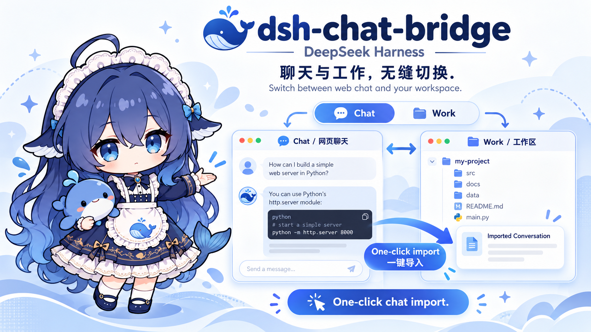

<p align="center">
  <a href="./README.md"></a>
  <a href="./README.en.md"></a>
</p>

# dsh-chat-bridge

**Seamlessly switch between DeepSeek web chat and your workspace inside DeepSeek Harness. Import a conversation into work with one click.**

<p align="center">
  
</p>

<p align="center">
  <a href="https://github.com/FrostLeafKEE/dsh-chat-bridge/releases/tag/v1.0.0">Download v1.0.0</a> ·
  <a href="#installation">Installation</a> ·
  <a href="./docs/COMPATIBILITY.md">Compatibility</a> ·
  <a href="./LICENSE">MIT License</a>
</p>

> The banner is a feature illustration. This is an independent community plugin targeting **DeepSeek Harness Desktop 0.2.0-rc.2**.

## From chat to work

Discuss an idea, analyze a problem, or plan a solution in DeepSeek web chat. Then import the current conversation into a workspace to continue working on the project.

| Feature | Experience |
| --- | --- |
| Chat / Work switch | A shared control at the top of the main area lets you return to the existing work session. |
| Embedded official web chat | Sign in, open existing conversations, and continue chatting within DSH. |
| Web history sidebar | Loaded website conversations appear below projects. Search titles, open a conversation, refresh, or load more. |
| One-click import | After reviewing the scope, selecting a workspace, and enabling quick transfer, later clicks import automatically. |
| Native history context | Questions, answers, and provenance are saved directly in a new work session. The input stays empty for your next task. |
| Separate local archives | Archives appear below project conversations and support search, rename, export, and deletion. |
| Manual import | UTF-8 `.txt`, `.md`, plugin history JSON, and plugin archive JSON are supported. |

Web chat runs through the official website. Importing history creates a session and saves its context without submitting a task or calling a model. Subsequent work requests use normal DeepSeek Harness behavior. Installation does not require changes to the official desktop source, EXE, or app.asar.

## Installation

Download a package from the [v1.0.0 release](https://github.com/FrostLeafKEE/dsh-chat-bridge/releases/tag/v1.0.0).

| Platform | File | Status |
| --- | --- | --- |
| Windows | `dsh-chat-bridge-1.0.0.tgz` | Work import was confirmed in earlier versions; the new web list still needs desktop validation. |
| macOS Apple Silicon / Intel | `dsh-chat-bridge-1.0.0-macos.zip` | Source adaptation and packaging are complete; not tested on a Mac. |

### Windows

Launch official DSH once to initialize it, then fully quit it, including the tray process. In PowerShell, use the CLI bundled with the desktop application:

```powershell
$dsh = Join-Path $env:LOCALAPPDATA 'Programs\DeepSeek Harness\resources\runtime\cli\bin\dsh.cmd'
$package = Join-Path $env:USERPROFILE 'Downloads\dsh-chat-bridge-1.0.0.tgz'
& $dsh plugin --profile desktop add $package
```

Adjust paths for a custom installation or download location, then reopen DSH. The same `add` command updates the plugin. Use the desktop application's bundled CLI to manage the `desktop` profile.

### macOS

Launch official DSH once to initialize it, then fully quit with **⌘Q**. Extract the ZIP, open a terminal in the extracted directory, and run:

```sh
/bin/bash ./install.command
```

For an application installed elsewhere:

```sh
/bin/bash ./install.command --app "/your/path/DeepSeek Harness.app"
```

The installer uses the CLI inside the selected `.app`. No additional Node, Python, or Homebrew installation is needed. See the [macOS guide](./docs/MACOS.md) for details.

## Usage

1. Select the chat area above New Session, or use the Chat entry near the bottom of the sidebar.
2. Sign in on the embedded official website and expand its sidebar. DSH’s **Web conversations** section mirrors the loaded list automatically. Click a title to open it, search titles, or use **Load more from the webpage**.
3. Click **Turn into work**, review the captured text, select an existing workspace, and accept the scope and context notices.
4. Confirm to save the source and create a work session containing the imported history. Enter your next task directly; there is no need to send the history again.
5. Enable remembering the destination and one-click transfer to import with one click next time. **Review before converting** and **Transfer settings** remain available.

The Chat / Work control only navigates between surfaces. Your work session and input draft remain available when you return. Work history is not automatically uploaded to the website. Use **Import history** and **Manage archives** in the sidebar for manual imports and exports.

## Current scope

- **The sidebar reads loaded titles and links every three seconds.** Collapsed groups and unloaded entries may be missing; the count is the loaded count. List metadata is kept only for this run. Message contents are saved only on explicit import or transfer. Sign-out, loading failure, or unsupported markup clears the list with a notice.

- **Capture covers the currently rendered branch and is marked partial.** Unrendered messages in long conversations, other branches, and attachment contents are not automatically retrieved. Review the preview when completeness matters.
- Capture supports a verified frontend build. Website changes, active generation, unsent drafts, or changing content stop the transfer with a notice.
- Complete the first sign-in on the official page. Login reuse is limited to the current application run; restarting may require signing in again.
- The plugin does not read or copy login credentials. Web chat uses an isolated guest; normal workspace capabilities apply after you select and import into a work session.
- Local archives are not encrypted. Import does not estimate model context capacity or shorten the source automatically. Review long or sensitive histories before importing.
- Limits are 5 MiB for ordinary input, 64 MiB for a complete archive file, and 5,000 structured messages. Oversized input is rejected rather than silently truncated.

Full history synchronization, attachment contents, and persistent login reuse are future work. See the [contracts](./docs/CONTRACTS.md), [native history import design](./docs/NATIVE-HISTORY.md), and [roadmap](./docs/NEXT-STEPS.md). See [web history sidebar](./docs/WEB-HISTORY.md) for the list contract.

## Uninstall

Fully quit DSH, then on Windows:

```powershell
& $dsh plugin --profile desktop remove dsh-chat-bridge
```

On macOS, from the extracted package directory:

```sh
/bin/bash ./remove.command
```

Uninstalling does not automatically delete local archives or imported work sessions. Export archives first if you need a separate copy.

## Development

Use Node `^22.19.0 || >=24.0.0` and npm with the committed lockfile.

```sh
git clone https://github.com/FrostLeafKEE/dsh-chat-bridge.git
cd dsh-chat-bridge
npm ci
npm run verify
npm run pack
python scripts/pack-macos.py
```

Source, tests, fixtures, and packaging scripts are kept in the repository. Dependencies, `lib/`, caches, and `dist/` build artifacts are excluded from Git; downloadable packages live in GitHub Releases.

The v1.0.0 review passed **191 tests across 20 files**, type checking, lint, and builds. Some tests use synthetic DOM and service doubles, so they do not replace Electron or macOS acceptance testing. See the [release review](./docs/RELEASE-1.0.0.md).

## License and credits

Code is licensed under [MIT](./LICENSE). The host and public plugin APIs come from [DeepSeek Harness](https://github.com/deepseek-ai/deepseek-harness). See [THIRD_PARTY_NOTICES](./THIRD_PARTY_NOTICES.md) for attribution.
